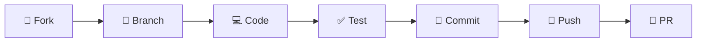

<div align="center">

# 🏥 Hospital Management System

*A modern, comprehensive healthcare administration platform*

[](https://reactjs.org/)
[](https://www.typescriptlang.org/)
[](https://vitejs.dev/)
[](https://tailwindcss.com/)

[🚀 Demo](#) • [📖 Documentation](#) • [🐛 Report Bug](#) • [💡 Request Feature](#)

</div>

---

## 📋 Table of Contents

- [🎯 Overview](#-overview)
- [✨ Features](#-features)
- [🛠️ Tech Stack](#️-tech-stack)
- [🚀 Quick Start](#-quick-start)
- [🏗️ Project Structure](#️-project-structure)
- [📱 Screenshots](#-screenshots)
- [🔧 Development](#-development)
- [🚀 Deployment](#-deployment)
- [🤝 Contributing](#-contributing)
- [📄 License](#-license)
- [👨‍💻 Author](#-author)

---

## 🎯 Overview

The **Hospital Management System** is a cutting-edge healthcare administration platform designed to revolutionize how medical facilities operate. Built with modern web technologies, it provides an intuitive interface for managing all aspects of hospital operations.

> 🌟 **Mission**: To streamline healthcare operations and improve patient care through efficient digital management solutions.

### 🎯 Key Objectives
- 📈 Improve operational efficiency
- 🏥 Enhance patient care quality
- 📊 Provide real-time analytics
- 🔒 Ensure data security and privacy
- 📱 Deliver seamless user experience

---

## ✨ Features

<table>
<tr>
<td width="50%">

### 👥 **Patient Management**
- 📝 Complete patient registration
- 🔄 Real-time information updates
- 📋 Medical history tracking
- 🔍 Advanced search capabilities

### 📅 **Appointment System**
- 🗓️ Smart scheduling algorithms
- ⏰ Automated reminders
- 📱 Multi-platform notifications
- 🔄 Easy rescheduling options

</td>
<td width="50%">

### 👨‍⚕️ **Staff Management**
- 🏷️ Role-based access control
- 📊 Performance tracking
- 📋 Shift management
- 💼 Department organization

### 📊 **Analytics Dashboard**
- 📈 Real-time statistics
- 🎯 KPI monitoring
- 📉 Trend analysis
- 📋 Custom reports

</td>
</tr>
</table>

### 🌟 **Additional Features**
- 🔒 **Security**: End-to-end encryption and HIPAA compliance
- 📱 **Responsive**: Seamless experience across all devices
- 🌐 **Multi-language**: Support for multiple languages
- 🎨 **Customizable**: Flexible theming and branding options

---

## 🛠️ Tech Stack

<div align="center">

### Frontend Technologies
[](https://reactjs.org/)
[](https://www.typescriptlang.org/)
[](https://vitejs.dev/)
[](https://tailwindcss.com/)

</div>

| Technology | Version | Purpose |
|------------|---------|---------|
| ⚛️ **React** | 18.3.1 | Frontend framework |
| 📘 **TypeScript** | 5.5.3 | Type safety |
| ⚡ **Vite** | 5.4.2 | Build tool & dev server |
| 🎨 **Tailwind CSS** | 3.4.1 | Styling framework |
| 🎯 **Lucide React** | 0.344.0 | Icon library |
| 🔍 **ESLint** | 9.9.1 | Code linting |

---

## 🚀 Quick Start

### 📋 Prerequisites

Ensure you have the following installed:

```bash
node --version  # v16.0.0 or higher
npm --version   # v8.0.0 or higher
```

### ⚡ Installation

1. **Clone the repository**
   ```bash
   git clone https://github.com/JohnGabriel1998/HospitalManagementSystem.git
   cd HospitalManagementSystem
   ```

2. **Install dependencies**
   ```bash
   npm install
   ```

3. **Start development server**
   ```bash
   npm run dev
   ```

4. **Open your browser**
   ```
   🌐 http://localhost:5173
   ```

### 🎯 Quick Commands

| Command | Description |
|---------|-------------|
| `npm run dev` | 🚀 Start development server |
| `npm run build` | 🏗️ Build for production |
| `npm run preview` | 👀 Preview production build |
| `npm run lint` | 🔍 Check code quality |

---

## 🏗️ Project Structure

```
🏥 HospitalManagementSystem/
├── 📁 src/
│   ├── 🧩 components/          # Reusable UI components
│   │   ├── ui/                 # Base UI components
│   │   ├── forms/              # Form components
│   │   └── layout/             # Layout components
│   ├── 📄 pages/               # Application pages
│   │   ├── dashboard/          # Dashboard pages
│   │   ├── patients/           # Patient management
│   │   └── appointments/       # Appointment system
│   ├── 🎣 hooks/               # Custom React hooks
│   ├── 🛠️ utils/               # Utility functions
│   ├── 📝 types/               # TypeScript definitions
│   └── 🎨 styles/              # Global styles
├── 🌍 public/                  # Static assets
├── 📦 package.json             # Dependencies
└── 📚 README.md                # Documentation
```

---

## 📱 Screenshots

<div align="center">

### 🏠 Dashboard Overview
*Coming soon...*

### 👥 Patient Management
*Coming soon...*

### 📅 Appointment Scheduling
*Coming soon...*

</div>

---

## 🔧 Development

### 🎨 Code Style Guidelines

```bash
# Run linter
npm run lint

# Run type checking
npx tsc --noEmit

# Format code (if prettier is configured)
npm run format
```

### 🏷️ Naming Conventions

- **Components**: PascalCase (`PatientCard.tsx`)
- **Hooks**: camelCase with 'use' prefix (`usePatientData.ts`)
- **Utilities**: camelCase (`formatDate.ts`)
- **Types**: PascalCase (`PatientType.ts`)

### 🔄 Git Workflow

```bash
# Create feature branch
git checkout -b feature/patient-search

# Commit changes
git commit -m "feat: add patient search functionality"

# Push and create PR
git push origin feature/patient-search
```

---

## 🚀 Deployment

### 🏗️ Build Process

```bash
# Build for production
npm run build

# Output directory
ls dist/
```

### 🌐 Deployment Options

| Platform | Command | Notes |
|----------|---------|-------|
| **Vercel** | `vercel deploy` | Recommended for React apps |
| **Netlify** | `netlify deploy --prod` | Easy continuous deployment |
| **GitHub Pages** | `npm run deploy` | Free hosting option |

---

## 🤝 Contributing

We welcome contributions! Please follow these steps:

<div align="center">



</div>

### 📝 Contribution Guidelines

1. **🍴 Fork** the repository
2. **🌿 Create** a feature branch
3. **💻 Make** your changes
4. **✅ Test** your changes
5. **📝 Commit** with clear messages
6. **🚀 Push** to your branch
7. **🔄 Submit** a Pull Request

### 🏷️ Issue Labels

- 🐛 `bug` - Something isn't working
- ✨ `enhancement` - New feature request
- 📚 `documentation` - Documentation improvements
- 🎨 `design` - UI/UX improvements

---

## 📄 License

```
📝 This project is created for educational and practice purposes.
Feel free to use and modify as needed for learning.
```

---

## 👨‍💻 Author

<div align="center">

### **John Gabriel**

[](https://github.com/JohnGabriel1998)
[](https://linkedin.com/in/johngabriel1998)
[](mailto:your.email@example.com)

*"Building the future of healthcare through technology"*

</div>

---

## 🙏 Acknowledgments

<div align="center">

**Special thanks to the amazing open-source community:**

[](https://reactjs.org/)
[](https://vitejs.dev/)
[](https://tailwindcss.com/)

</div>

---

<div align="center">

### 🌟 **Star this repository if you found it helpful!** 🌟

**Made with ❤️ for the healthcare community**

*Improving healthcare delivery through efficient digital management* 

**⚡️ Happy Coding! ⚡️**

</div>
